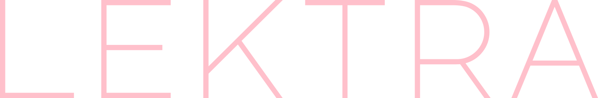

    <b><i>High-performance document and image viewer that prioritizes screen space and control.</i></b>

    <a href="https://dheerajshenoy.github.io/lektra" target="_blank">Homepage</a> |
    <a href="https://dheerajshenoy.github.io/lektra/installation.html" target="_blank">Installation</a> |
    <a href="https://dheerajshenoy.github.io/lektra/configuration.html" target="_blank">Configuration</a>

**NOTE: For the latest updates and breaking changes (if any), please check the [CHANGELOG.md](CHANGELOG.md), where the description of the latest changes in features, config, bug fixes etc. are updated frequently.**

## Support file formats

- PDF
- XPS
- CBZ
- FB2
- EPUB
- FictionBook
- Mobi
- Images
    - JPG
    - PNG
    - SVG
    - TIFF
- DjVu (if compiled)

## Screenshots

   
  <strong>Scrolling</strong>

   
  <strong>Tabs and Splits</strong>

   
  <strong>Portals</strong>

   
  <strong>Preview</strong>

   
  <strong>Layouts</strong>

   
  <strong>Outline Overlay</strong>

   
  <strong>Search + Hits in Scrollbar</strong>

   
  <strong>Jump Markers</strong>

   
  <strong>Link Hints</strong>

   
  <strong>Command Palette</strong>

   
  <strong>SyncTeX integration</strong>

# Contributing

Check out [CONTRIBUTING.md](CONTRIBUTING.md)

### Thanks to all the contributors who have helped (and helping) make this project better (in no particular order):

- [barrettruth](https://github.com/barrettruth) - For contributing the NixOS flake and issue report templates.
- [techmanwalker](https://github.com/techmanwalker) - For initiating translations and contributing the Spanish translation.
- [linwaytin](https://codeberg.org/linwaytin) - For providing valuable feedback and bug reports and feature-requesting annotation comment.
- [douglarek](https://github.com/douglarek) - For packaging lektra to [gentoo-zh](https://github.com/microcai/gentoo-zh).
- [Zou Yonghe](https://codeberg.org/budingZou) - For creating macOS app bundle.

## If you want to support me

